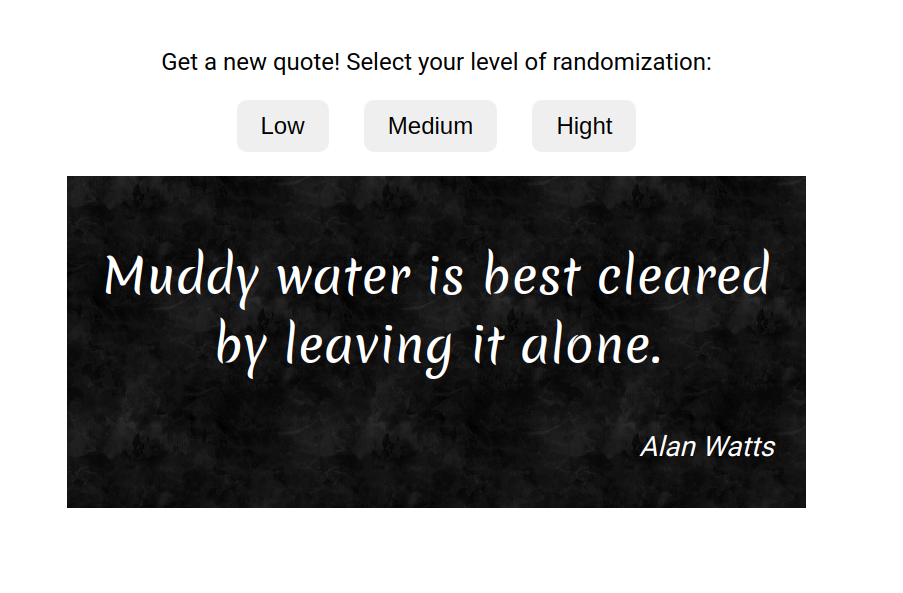

 

## Description

[Live demo](https://alice-rez.github.io/Quote-of-the-day/)

Application that get quotes from API and display them with different level of randomization. User can choose, witch level of randomization he want to use by clicking on respective button:

1. **low** - all quotes will be displayed in random order without repeating

2. **medium** - there can be repetitions in quotes but not direct - next element will be everytime different than previous one

3. **high** - quote is generated totally randomly, there are no restrictions for repetitions

Change of the level of randomization is immediate, but it can take time till he will be able for example to see all of the quotes when changed to the low level (it depends on how much quotes he already saw using higher levels).

## Implementation

Used API from [Karan Dahiya](https://github.com/KaranDahiya/philosophy-quotes-API).

**Used technologies**: Vanilla JS, DOM, asynchronous Javascript (fetch), API, HTML, CSS,

The main function ( _getQuote(array,level)_ ) for all of the levels is same. Which type of randomization will be used depends on which argument we insert for level (options are _high_, _medium_ and _low_) - this determines,which additional part of code will be used (default case is high level).

Function _getQuote_ basically generates random number (using function _chooseRandom_ ) and use from the array of quotes that one with the same index.

For the lower levels of the randomization, I defined two variables that are used for storing of the indexes that were already used - for medium level it is _previousIndex_ for low _usedIndexes_. When I want low level of randomization, I basically generate random nr (index) till I do not get index that was not used. The used indexes are stored in these variables everytime to enable quicker switch to lower level of randomization.
